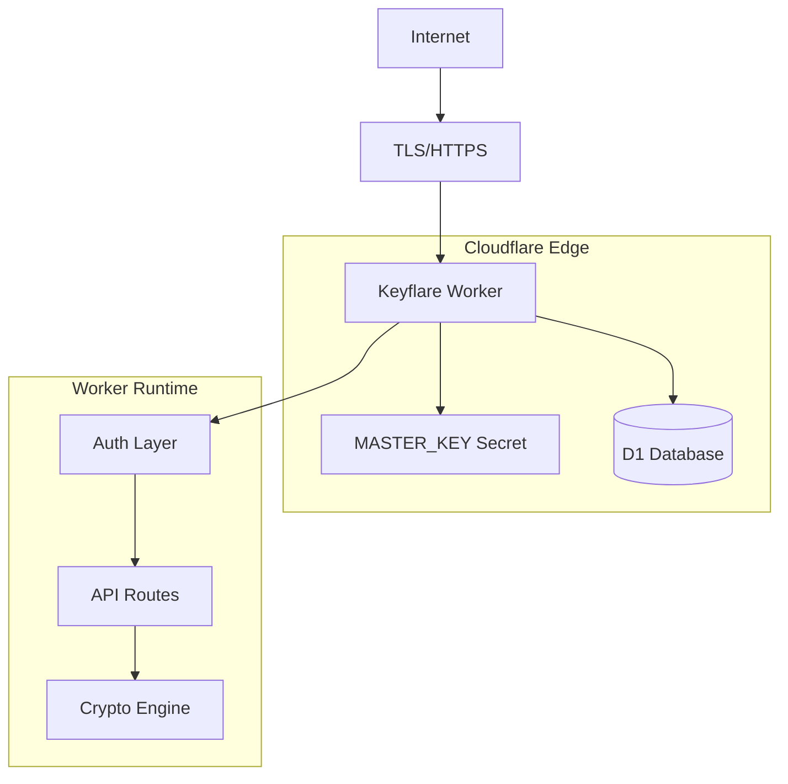
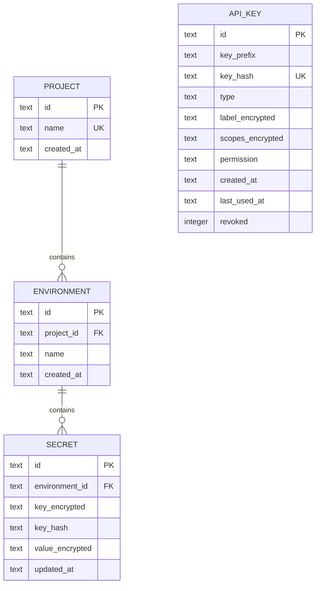
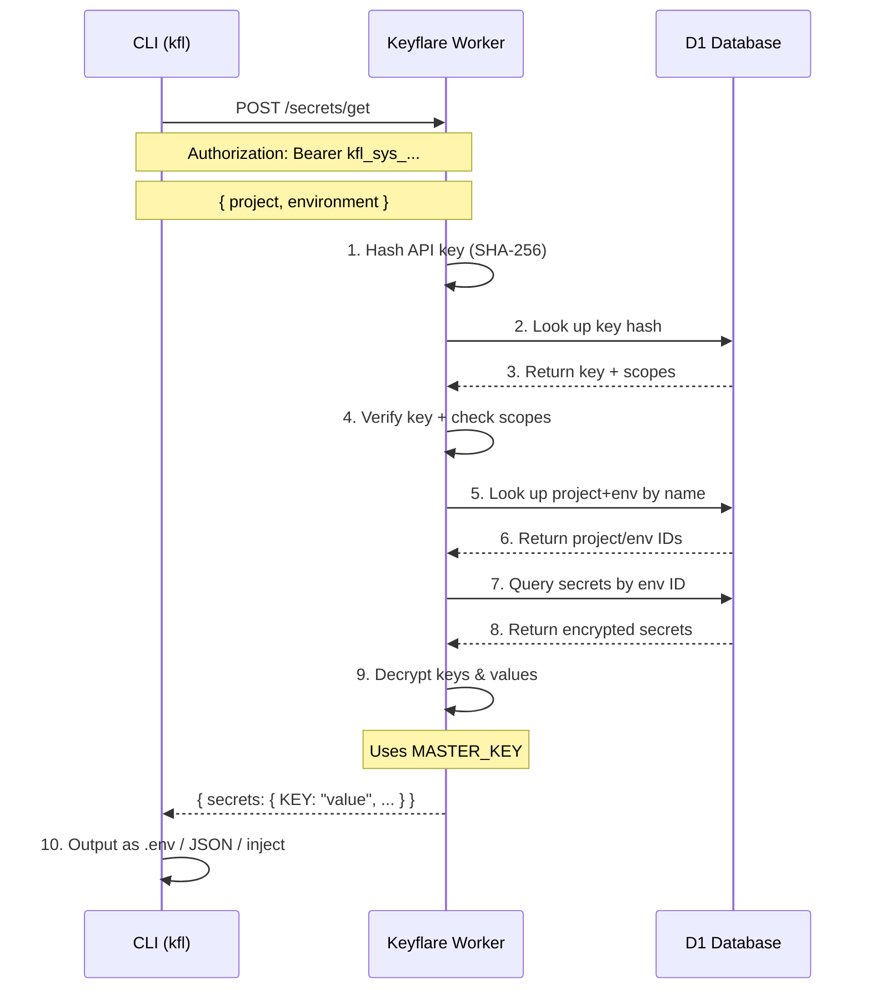

# Architecture Overview

Keyflare is a self-hosted secrets manager that runs as a single Cloudflare Worker backed by a single D1 database.

## Core Principles

1. **Single deployment target** — One Worker, one D1 database, one master secret
2. **Zero trust storage** — Secret keys and values are encrypted at rest
3. **Minimal surface area** — No users, no sessions, no OAuth
4. **Simple mental model** — Projects → Environments → Secrets

## Infrastructure



**Total infrastructure:** 1 Worker + 1 D1 database + 1 secret

## Data Model



### Projects

A project is a namespace for secrets (e.g., `my-api`, `frontend-app`).

### Environments

Each project has environments (e.g., `production`, `staging`, `development`). New projects get **Dev** and **Prod** environments by default.

### Secrets

Key-value pairs stored per environment. Both key names and values are encrypted with AES-256-GCM.

### API Keys

Two types:
- **User keys** (`kfl_user_*`) — Full admin access
- **System keys** (`kfl_sys_*`) — Scoped to specific project:environment pairs

## Request Flow



## Monorepo Structure

```
keyflare/
├── packages/
│   ├── server/    # Cloudflare Worker
│   │   ├── src/
│   │   │   ├── index.ts         # Hono app + routes
│   │   │   ├── db/              # Drizzle schema + queries
│   │   │   ├── middleware/      # Auth, validation
│   │   │   └── lib/             # Crypto, utilities
│   │   └── migrations/          # SQL migrations
│   │
│   ├── cli/       # CLI (kfl)
│   │   └── src/
│   │       ├── index.ts         # Entry point
│   │       └── commands/        # Command handlers
│   │
│   └── shared/    # Shared types & utilities
│       └── src/
│           └── types.ts         # TypeScript types
│
├── docs/          # Documentation
└── package.json   # Root package
```

### NPM Package Bundling

When published, the `@keyflare/cli` package bundles the server code:

```
@keyflare/cli/
├── dist/
│   ├── index.js              # Bundled CLI
│   └── server/               # Bundled server (for wrangler deploy)
│       ├── src/
│       ├── migrations/
│       ├── wrangler.jsonc
│       └── package.json
```

This allows `kfl init` to deploy the Worker without requiring users to clone the repository.

## Technology Stack

| Component | Technology | Rationale |
|-----------|------------|-----------|
| Web framework | Hono | Ultrafast, typed, Cloudflare-native |
| Validation | Zod | Declarative schemas with type inference |
| Runtime | Cloudflare Workers | Edge deployment, zero cold starts |
| Database | Cloudflare D1 (SQLite) | Zero config, co-located with Worker |
| Encryption | AES-256-GCM | Native Web Crypto API |
| API key hashing | SHA-256 | Fast, native, sufficient for 128-bit keys |
| Lookup hashing | HMAC-SHA256 | Deterministic, keyed |
| CLI framework | Commander.js | Mature, TypeScript-native |
| ORM | Drizzle | Type-safe, generates migrations |
| Build | tsup / wrangler | Fast bundling |

## Next Steps

<CardGroup cols={2}>
  <Card title="Security Model" href="/architecture/security">
    Learn about encryption and threat mitigation.
  </Card>

  <Card title="Encryption" href="/architecture/encryption">
    Deep dive into the crypto implementation.
  </Card>
</CardGroup>
