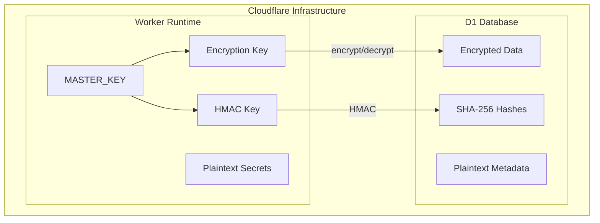
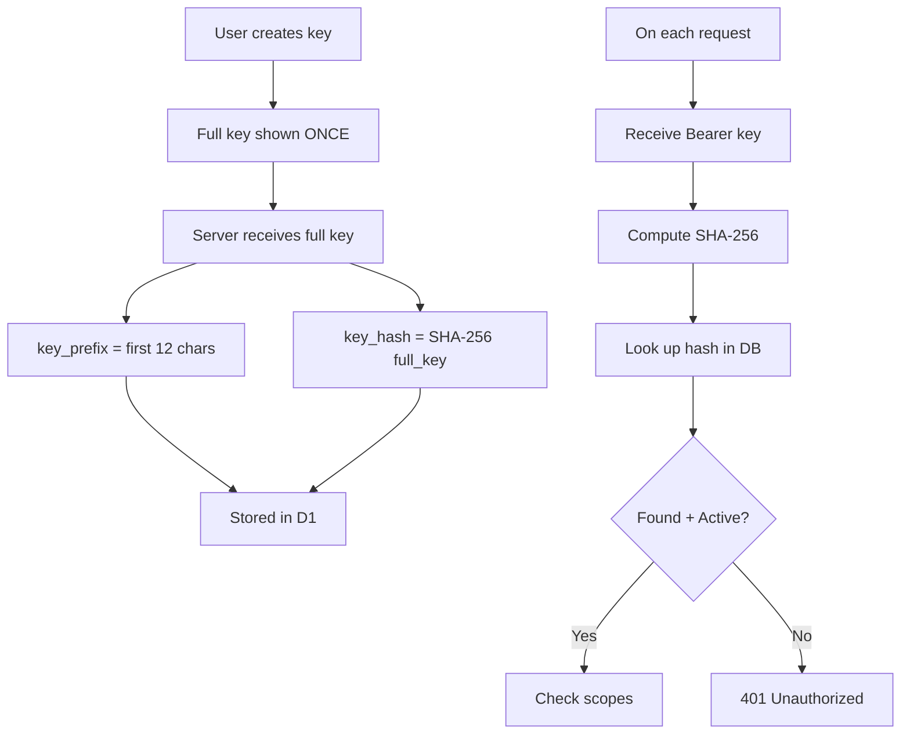

Keyflare's security architecture is designed around zero trust storage and minimal attack surface.

## Threat Model

| Threat                    | Mitigation                                                                              |
| ------------------------- | --------------------------------------------------------------------------------------- |
| D1 database dump/leak     | Secret values and keys are AES-256-GCM encrypted. API keys are hashed.                  |
| API key theft             | Keys are scoped. System keys only access specific project:environment pairs.            |
| Network interception      | All traffic is TLS-encrypted (HTTPS enforced by Cloudflare).                            |
| Master key compromise     | Single point of failure by design. See [Master Key Management](#master-key-management). |
| Brute-force key guessing  | API keys are 256-bit random. Keyspace is 2^256 — infeasible.                            |
| Insider threat (DB admin) | Encrypted data is unreadable without master key (Worker secret).                        |

## Security Boundaries



**Key principle:** Plaintext secrets exist ONLY in Worker memory during request processing. Never logged, never cached.

## What Gets Encrypted

### Encrypted (AES-256-GCM)

- Secret values (`DB_PASSWORD=hunter2`)
- Secret key names (`DB_PASSWORD`)
- API key labels
- System key scope definitions

### NOT Encrypted (by design)

- Row IDs (UUIDs — no information leakage)
- Timestamps (created_at, updated_at)
- Project names
- Environment names
- API key type (`user` / `system`)
- API key permission level
- Revocation status

## API Key Security

### Key Format

```text
kfl_user_<32 hex chars>    # User key — 128 bits entropy
kfl_sys_<32 hex chars>     # System key — 128 bits entropy
```

Examples:

```text
kfl_user_a1b2c3d4e5f6a7b8c9d0e1f2a3b4c5d6
kfl_sys_f6e5d4c3b2a1f6e5d4c3b2a1f6e5d4c3
```

The prefix makes key type identifiable and enables secret scanning tools to detect leaked keys.

### Key Storage



<Note>
  **Why SHA-256 and not Argon2id?** API keys have 128 bits of entropy (vs ~40 bits for passwords), making brute-force infeasible regardless of hash speed. SHA-256 is fast, native, and adds zero dependencies.
</Note>

### Permission Levels

|                              | Read       | Write      | Manage Projects | Manage Keys |
| ---------------------------- | :--------: | :--------: | :-------------: | :---------: |
| **User key**                 | ✅          | ✅          | ✅               | ✅           |
| **System key** — `read`      | ✅ (scoped) | ❌          | ❌               | ❌           |
| **System key** — `readwrite` | ✅ (scoped) | ✅ (scoped) | ❌               | ❌           |

## Master Key Management

### Single Point of Failure

The master key is the single root of trust. **If lost, all encrypted data is permanently unrecoverable.** There is no backdoor.

### Mitigations

1. **Managed by Cloudflare** — Stored as Worker secret, encrypted at rest
2. **User backup required** — Must save key in password manager or physical safe
3. **Clear warnings** — `kfl init` prompts to confirm key was saved

### Master Key Format

| Property     | Requirement                  |
| ------------ | ---------------------------- |
| Encoding     | Standard base64 (RFC 4648)   |
| Length       | 44 characters (with padding) |
| Decoded size | Exactly 32 bytes             |
| Entropy      | 256 bits                     |

Example:

```text
K7gNU3sdo+OL0wNhqoVWhr3g6s1xYv72ol/pe/Unols=
```

### Generation

```bash
# Generate cryptographically random 256-bit key
openssl rand -base64 32
```

Or let `kfl init` generate one automatically.

### Update Behavior

When running `kfl init` on an existing deployment:

- **Master key is NEVER changed** — even if `--master-key` is provided
- This prevents catastrophic data loss from accidental key rotation

## Next Steps

<CardGroup cols={2}>
  <Card href="/architecture/encryption" title="Encryption Details">
    Deep dive into the crypto implementation.
  </Card>
  <Card href="/guides/api-keys" title="API Keys">
    Learn how to create and manage API keys.
  </Card>
</CardGroup>