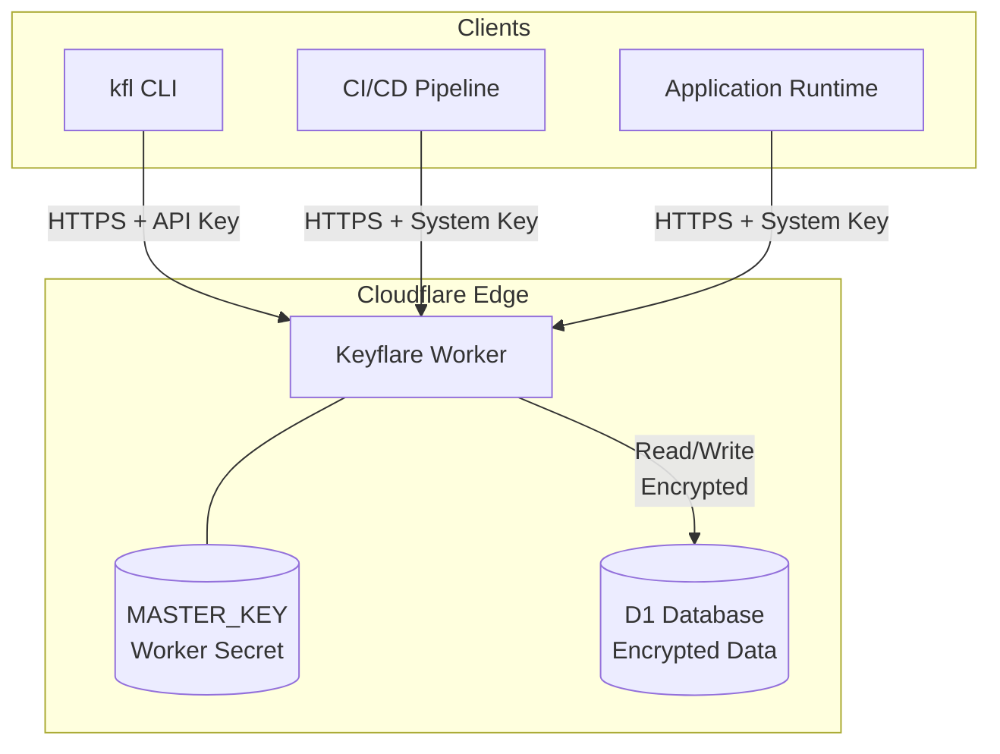
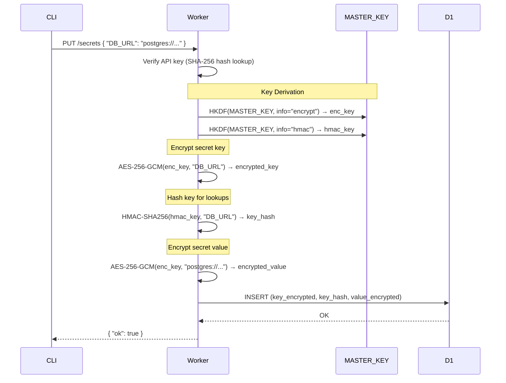
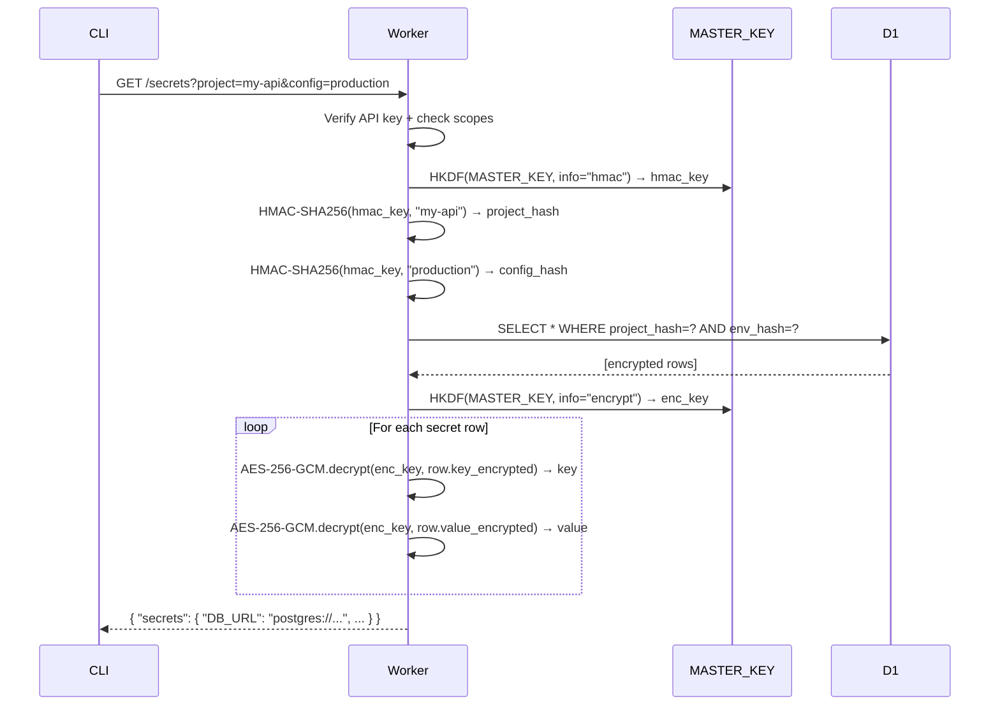
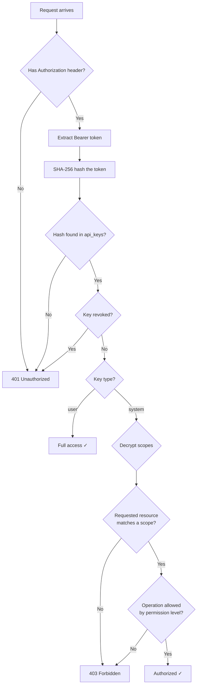
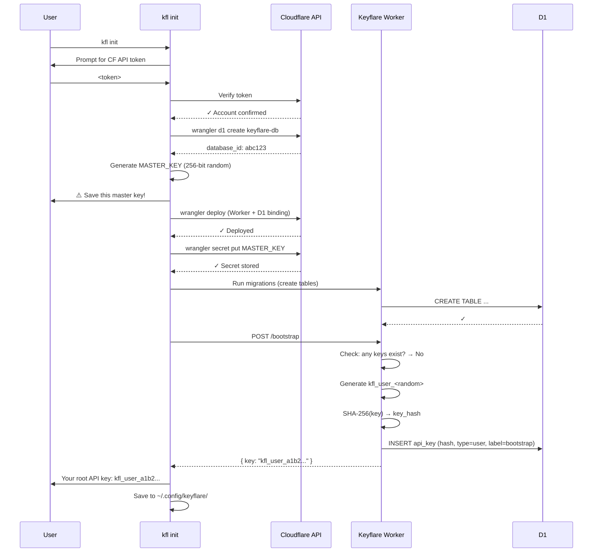
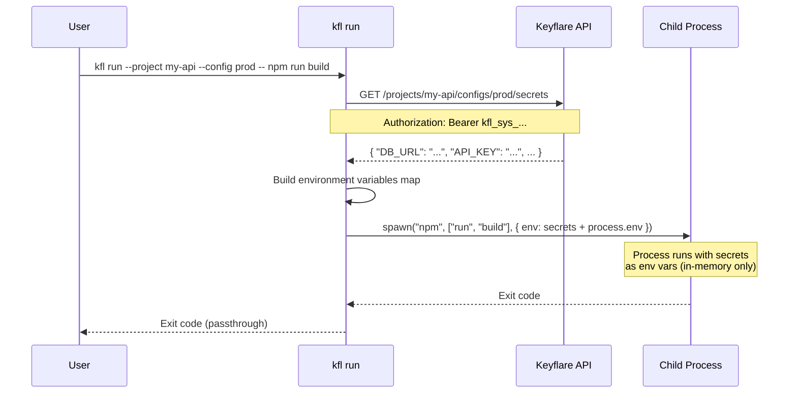
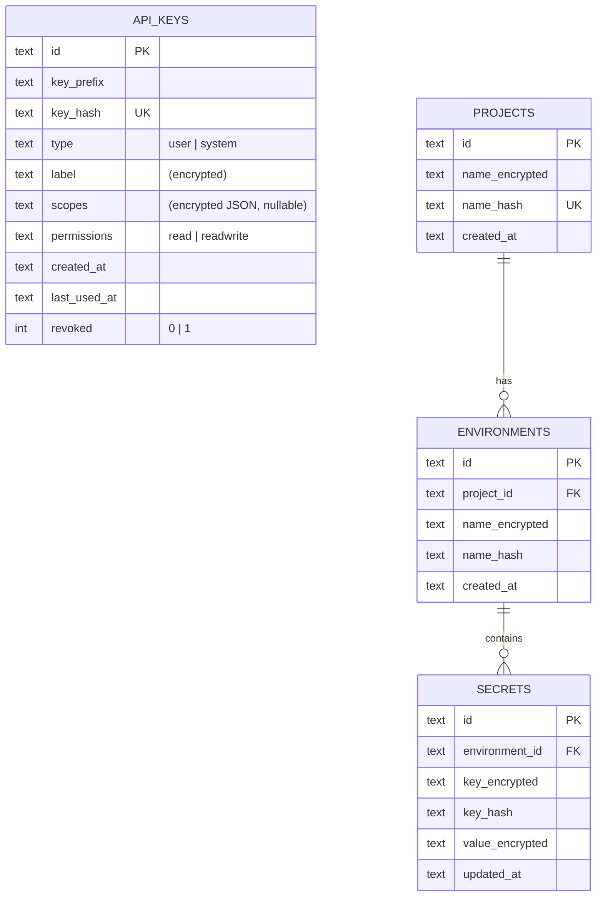
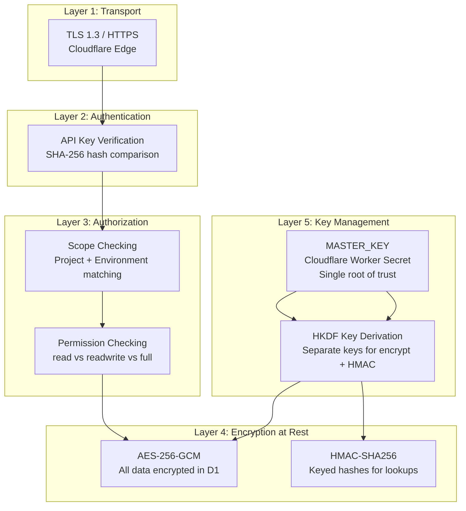
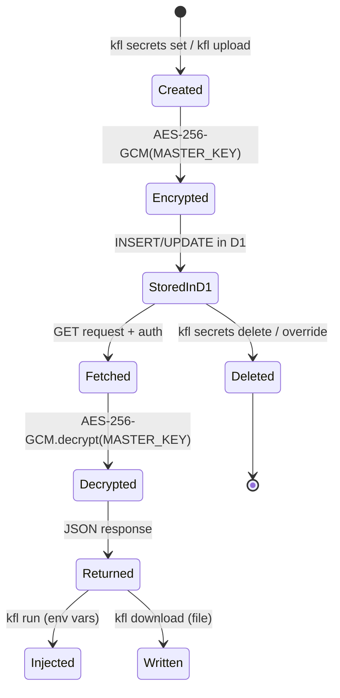

# Keyflare — Flow Diagrams

All diagrams use [Mermaid](https://mermaid.js.org/) syntax and render natively on GitHub.

---

## 1. System Overview

---

## 2. Encryption Flow — Writing a Secret

---

## 3. Encryption Flow — Reading Secrets

---

## 4. API Key Authentication Flow

---

## 5. Bootstrap Flow

---

## 6. `kfl run` — Command Injection Flow

---

## 7. Data Model (Entity Relationship)

---

## 8. Security Layers

---

## 9. Secret Lifecycle

