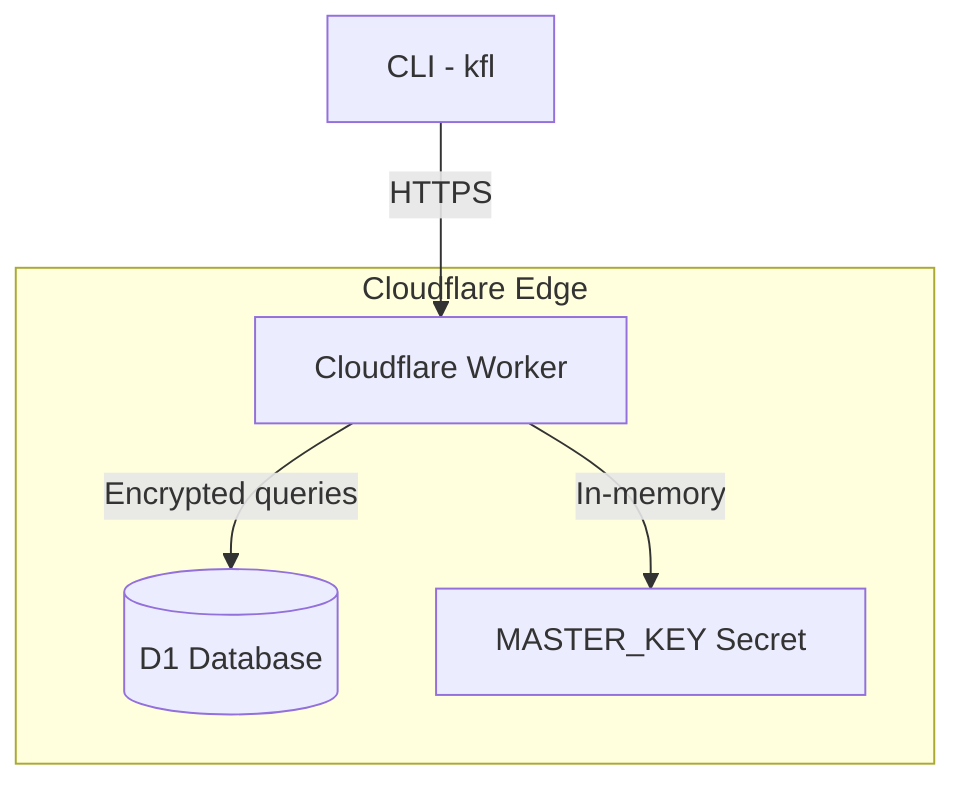

<Frame>
  
</Frame>

# Keyflare

**Open-source secrets manager built entirely on Cloudflare.**

Single Worker + single D1 database + single master key. Zero trust storage. Self-hosted in one click.

Think of it as a self-hosted [Doppler](https://www.doppler.com/) or [Infisical](https://infisical.com/) — but runs entirely on Cloudflare with zero infrastructure to manage.

## Why Keyflare?

<CardGroup cols={2}>
  <Card icon="fire" title="Free + Open Source">
    MIT licensed. No restrictions, no lock-in. Own your secrets infrastructure completely.
  </Card>
  <Card icon="server" title="Self-Hosted">
    Deploy to your own Cloudflare account in seconds. All you need is a **free Cloudflare account**.
  </Card>
  <Card icon="cube" title="Simple Architecture + One-Click install">
    One Worker, one D1 database, one master key. No containers, no VMs, no Kubernetes.
  </Card>
  <Card icon="lock" title="Zero Trust Storage">
    Secret values and keys are AES-256-GCM encrypted at rest. Even with database access, data remains protected.
  </Card>
</CardGroup>

## Core Concepts

Keyflare uses a simple mental model: **Projects → Environments → Secrets**.

```text
Project (my-api)
├── Environment (development)
│   ├── DATABASE_URL=postgres://...
│   └── API_KEY=sk_dev_...
├── Environment (staging)
│   ├── DATABASE_URL=postgres://...
│   └── API_KEY=sk_staging_...
└── Environment (production)
    ├── DATABASE_URL=postgres://...
    └── API_KEY=sk_live_...
```

### Projects

A project is a namespace for secrets (e.g., `my-api`, `frontend-app`). Each project can have multiple environments.

### Environments

Each project has environments (e.g., `production`, `staging`, `development`). New projects get two default environments (**Dev** and **Prod**) unless created with the `--environmentless` flag.

### Secrets

Key-value pairs stored per environment. Both key names and values are encrypted in D1 using AES-256-GCM.

## API Keys

Keyflare uses API keys for authentication. There are two types:

|             | User Key                                  | System Key                                  |
| ----------- | ----------------------------------------- | ------------------------------------------- |
| **Prefix**  | `kfl_user_*`                              | `kfl_sys_*`                                 |
| **Access**  | Full admin (all projects, keys, settings) | Scoped to specific project:environment      |
| **Use for** | Developers, admins, backup keys           | CI/CD, deployment scripts, runtime services |

**User keys** have full unrestricted access to everything — projects, environments, secrets, and API key management.

**System keys** are scoped to specific `(project, environment)` pairs with either `read` or `readwrite` permission. They cannot create projects, environments, or other keys.

## How It Works



1. **CLI** (`kfl`) communicates with the Worker API over HTTPS
2. **Worker** validates API keys, enforces scopes, encrypts/decrypts secrets
3. **D1 Database** stores encrypted secret data and hashed API keys
4. **MASTER_KEY** (Worker secret) is used for all encryption/decryption operations

## Next Steps

<CardGroup cols={2}>
  <Card href="/getting-started/quickstart" title="Quick Start">
    Deploy Keyflare to your Cloudflare account in minutes.
  </Card>
  <Card href="/getting-started/requirements" title="Requirements">
    What you need before getting started.
  </Card>
</CardGroup>