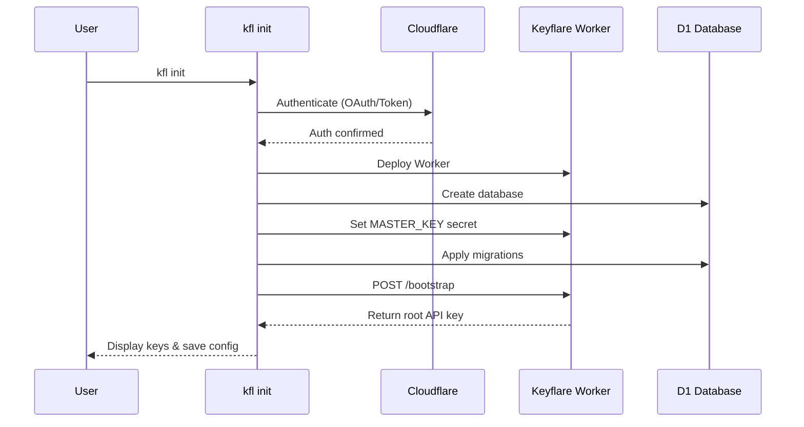

# Quick Start

Get Keyflare running on your Cloudflare account in just a few commands.

## Prerequisites

<CardGroup cols={2}>
  <Card title="Node.js" icon="terminal">
    Node.js 20+ installed on your machine.
  </Card>

  <Card title="Cloudflare Account" icon="cloud">
    A Cloudflare account. **Free tier works perfectly.**
  </Card>
</CardGroup>

## Installation

Install the Keyflare CLI globally:

```bash
npm install -g @keyflare/cli
```

Or use it directly with npx:

```bash
npx @keyflare/cli init
```

## Deploy Keyflare

Run the initialization command:

```bash
kfl init
```

You'll be prompted to authenticate with Cloudflare:

<Tabs>
  <Tab title="Browser (OAuth)">
    Opens `cloudflare.com` in your browser. Wrangler caches the OAuth session locally, so subsequent runs reuse the session automatically.
  </Tab>

  <Tab title="API Token">
    Generate a token at [Cloudflare Dashboard](https://dash.cloudflare.com/profile/api-tokens) with these permissions:
    - `Workers Scripts:Edit`
    - `D1:Edit`
    - `Workers Routes:Edit`
    
    Or set `CLOUDFLARE_API_TOKEN` in your environment to skip the prompt (CI-friendly).
  </Tab>
</Tabs>

## What `kfl init` Does



<Steps>
  <Step title="Authenticate">
    Checks for existing Wrangler session or prompts for authentication method.
  </Step>

  <Step title="Deploy Worker">
    Deploys the Keyflare Worker to your Cloudflare account via `wrangler deploy`.
  </Step>

  <Step title="Create Database">
    Wrangler auto-provisions the D1 database from the configuration.
  </Step>

  <Step title="Set Master Key">
    Generates a 256-bit `MASTER_KEY` and stores it as a Worker secret.
  </Step>

  <Step title="Apply Migrations">
    Runs Drizzle migrations to create the database schema.
  </Step>

  <Step title="Bootstrap">
    Creates the first root user key via the `/bootstrap` endpoint.
  </Step>

  <Step title="Save Configuration">
    Saves the API URL and root key to `~/.config/keyflare/`.
  </Step>
</Steps>

## Expected Output

```
🔥 Keyflare — Initial Setup

? How would you like to authenticate with Cloudflare?
❯ Browser (OAuth) — opens cloudflare.com in your browser
  API Token — paste a Cloudflare API token

✓ Authenticated as: my-account
✓ Worker deployed: https://keyflare.my-account.workers.dev
✓ No MASTER_KEY secret found
✓ Master key stored as Worker secret

⚠ MASTER KEY — Save this somewhere safe. It cannot be recovered!

  K7gNU3sdo+OL0wNhqoVWhr3g6s1xYv72ol/pe/Unols=

? I have saved the master key  Yes

✓ Database migrations applied
✓ User key created

✓ Keyflare deployed successfully!

⚠ IMPORTANT: Your user key

This key is required for `kfl login`. It has been saved to
~/.config/keyflare/credentials, but you should back it up securely.
If lost, recovery requires manual database operations.

API URL: https://keyflare.my-account.workers.dev
Config:  ~/.config/keyflare/
```

<Warning>
  **Save your master key!** If lost, all encrypted data becomes permanently unrecoverable.
</Warning>

## Next Steps

Now that Keyflare is deployed, you can:

<CardGroup cols={2}>
  <Card title="Create a Project" href="/guides/projects">
    Organize your secrets into projects and environments.
  </Card>

  <Card title="Add Secrets" href="/guides/secrets">
    Store your first secrets in Keyflare.
  </Card>

  <Card title="Create API Keys" href="/guides/api-keys">
    Generate scoped keys for CI/CD and services.
  </Card>

  <Card title="Local Development" href="/guides/local-development">
    Run Keyflare locally without a Cloudflare account.
  </Card>
</CardGroup>

## Using a Custom Master Key

For compliance or backup purposes, you can provide your own master key:

```bash
# Generate a key
openssl rand -base64 32

# Use during init
kfl init --master-key "K7gNU3sdo+OL0wNhqoVWhr3g6s1xYv72ol/pe/Unols="
```

<Note>
  If `MASTER_KEY` already exists on the worker, the provided key is ignored. This prevents accidental data loss from key rotation.
</Note>
