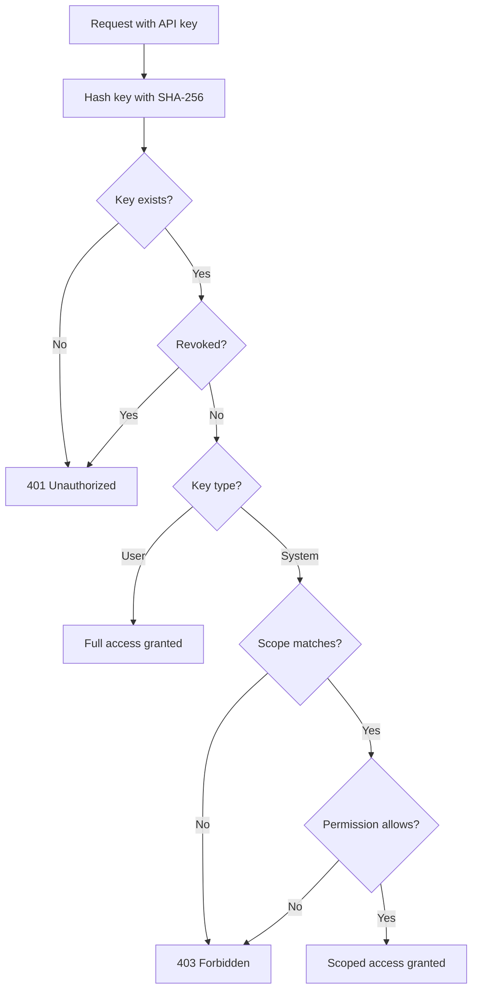

# API Keys & Access Control

Keyflare uses API keys for authentication. There are two types with different access levels.

## Key Types

| | User Key | System Key |
|---|---|---|
| **Prefix** | `kfl_user_*` | `kfl_sys_*` |
| **Access** | Full admin | Scoped to project:environment |
| **Use for** | Developers, admins | CI/CD, deployment scripts |

### User Keys (`kfl_user_*`)

- **Full admin access** to everything
- Can manage all projects, environments, secrets, and other API keys
- No scoping required — access to all resources
- Use for: developers, admins, backup keys

### System Keys (`kfl_sys_*`)

- **Scoped access** to specific project:environment pairs
- Can only read or write secrets within their scope
- Cannot create projects, environments, or other keys
- Use for: CI/CD pipelines, deployment scripts, runtime services

## Permission Levels

| | Read Secrets | Write Secrets | Manage Projects | Manage Keys |
|---|:---:|:---:|:---:|:---:|
| **User key** | ✅ | ✅ | ✅ | ✅ |
| **System key** — `read` | ✅ (scoped) | ❌ | ❌ | ❌ |
| **System key** — `readwrite` | ✅ (scoped) | ✅ (scoped) | ❌ | ❌ |

## Create API Keys

### User Key

```bash
kfl keys create --type user --label "backup-admin"
# Output: kfl_user_b2c3d4e5f6a7b8c9d0e1f2a3b4c5d6e7
```

<Warning>
  The full key is shown **only once**. Save it securely — it cannot be retrieved again.
</Warning>

### System Key

System keys require `--scope` and `--permission` flags:

```bash
# Read-only access to production
kfl keys create --type system \
  --label "github-actions-prod" \
  --scope "my-api:production" \
  --permission read

# Read-write access to all environments in a project
kfl keys create --type system \
  --label "dev-script" \
  --scope "my-api:*" \
  --permission readwrite

# Multiple scopes
kfl keys create --type system \
  --label "staging-deployer" \
  --scope "my-api:staging" \
  --scope "frontend:staging" \
  --scope "worker:staging" \
  --permission readwrite
```

<Note title="Zsh Users">
  The `*` wildcard must be quoted to prevent shell expansion:
  ```bash
  # Correct
  kfl keys create --type system --scope "my-api:*" --permission read
  
  # Wrong (Zsh error: "no matches found")
  kfl keys create --type system --scope my-api:* --permission read
  ```
</Note>

### Scope Format

Scopes follow the format `project:environment`:

| Scope | Meaning |
|-------|---------|
| `my-api:production` | Access to production environment only |
| `my-api:staging` | Access to staging environment only |
| `my-api:*` | Access to ALL environments in my-api |

## List Keys

```bash
kfl keys list
```

Output:
```
PREFIX          TYPE    LABEL              PERMISSION  SCOPES               CREATED
kfl_user_a1b2   user    bootstrap          full        *                    2024-01-15
kfl_user_b2c3   user    backup-admin       full        *                    2024-01-16
kfl_sys_c3d4    system  github-actions     read        my-api:production    2024-01-16
kfl_sys_d4e5    system  dev-script         readwrite   my-api:*             2024-01-17
```

## Update System Keys

Update scopes and permissions for an existing system key:

```bash
# Add staging access (must include ALL scopes)
kfl keys put kfl_sys_c3d4 \
  --scope "my-api:production" \
  --scope "my-api:staging" \
  --permission read
```

<Note>
  `kfl keys put` **replaces all existing scopes** with the new set. Copy current scopes from `kfl keys list` and modify as needed.
</Note>

## Revoke Keys

```bash
kfl keys revoke kfl_sys_c3d4
```

Revocation is instant — the key can no longer authenticate.

## Authorization Flow



## CI/CD Integration

### GitHub Actions

```yaml
# .github/workflows/deploy.yml
name: Deploy

on:
  push:
    branches: [main]

jobs:
  deploy:
    runs-on: ubuntu-latest
    steps:
      - uses: actions/checkout@v4
      
      - name: Install Keyflare CLI
        run: npm install -g @keyflare/cli
      
      - name: Deploy with secrets
        env:
          KEYFLARE_API_KEY: ${{ secrets.KEYFLARE_API_KEY }}
          KEYFLARE_API_URL: https://keyflare.your-account.workers.dev
        run: |
          kfl run --project my-api --env production -- npm run deploy
```

Create a system key for GitHub Actions:
```bash
kfl keys create --type system \
  --label "github-actions" \
  --scope "my-api:production" \
  --permission read
```

Store the key in GitHub repository secrets as `KEYFLARE_API_KEY`.

### Docker

```bash
# Build with secrets
kfl run --project my-api --env production -- docker build -t my-api .

# Run with secrets
kfl run --project my-api --env production -- docker run my-api
```

## Next Steps

<CardGroup cols={2}>
  <Card title="Local Development" href="/guides/local-development">
    Run Keyflare locally without Cloudflare.
  </Card>

  <Card title="Deployment" href="/guides/deployment">
    Production deployment best practices.
  </Card>
</CardGroup>
