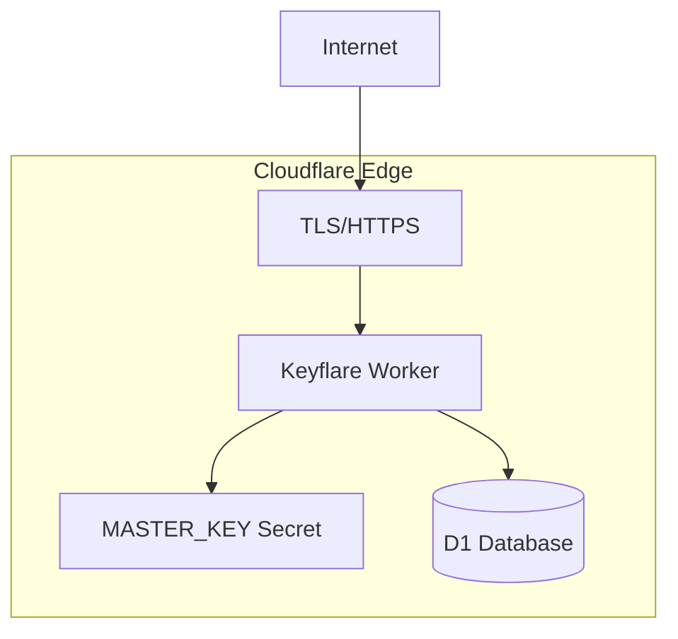

# Deployment

Deploy Keyflare to your Cloudflare account for production use.

## One-Click Deployment

```bash
kfl init
```

This single command handles everything:
1. Authenticates with Cloudflare (reuses existing session, or prompts for OAuth/API token)
2. Checks whether the `keyflare` worker already exists on your account
3. Deploys (or redeploys) the Worker via `wrangler deploy`
4. Resolves the D1 `database_id` from the **live worker bindings** — reads directly from Cloudflare, never trusts local config
5. Creates an ephemeral wrangler config with the resolved `database_id` (source `wrangler.jsonc` is never modified)
6. Generates and stores the master key (skipped if one already exists)
7. Applies database migrations using the resolved `database_id` explicitly
8. Creates the first root API key (idempotent)

## Deployment Architecture



**Total infrastructure:** 1 Worker + 1 D1 database + 1 secret

## Updates

To update your deployment:

```bash
# Update the CLI
npm install -g @keyflare/cli@latest

# Redeploy (idempotent)
kfl init
```

`kfl init` is idempotent. Re-running it:
- Redeploys the Worker
- Keeps the existing `MASTER_KEY` unchanged
- Runs pending migrations
- Safely re-calls bootstrap (no-op if already initialized)

<Note>
  Deleting the Worker does NOT delete the D1 database. To delete everything:
  ```bash
  wrangler d1 delete keyflare
  ```
</Note>

## Custom Domains

Add a custom domain to your Worker:

<Tabs>
  <Tab title="Cloudflare Dashboard">
    1. Go to **Workers & Pages → keyflare → Settings → Triggers**
    2. Click **Custom Domains**
    3. Add: `secrets.yourdomain.com`
  </Tab>

  <Tab title="wrangler.jsonc">
    Add to your `wrangler.jsonc`:
    ```json
    {
      "routes": [
        {
          "pattern": "secrets.yourdomain.com/*",
          "zone_name": "yourdomain.com"
        }
      ]
    }
    ```
    Then run `kfl init` to redeploy.
  </Tab>
</Tabs>

## Monitoring

### Health Check

```bash
curl https://keyflare.your-account.workers.dev/health
# → { "ok": true, "data": { "ok": true, "version": "0.1.0" } }
```

### Worker Logs

```bash
# Real-time logs
cd packages/server && npx wrangler tail

# Errors only
npx wrangler tail --status error
```

### D1 Metrics

Available in Cloudflare dashboard under **Workers & Pages → D1**:
- Query count
- Rows read/written
- Database size
- Error rate

## Backup & Recovery

### D1 Backup

Cloudflare automatically backs up D1. Export manually:

```bash
cd packages/server
npx wrangler d1 export keyflare --output backup.sql
```

### Master Key Backup

<Warning>
  **The MASTER_KEY is critical.** Without it, all encrypted data is permanently unrecoverable.
</Warning>

Recommended storage:
- Password manager (1Password, Bitwarden)
- Printed in a physical safe
- HSM for enterprise setups

**Never store in:**
- Git repository
- Plain text files
- CI environment variables
- The D1 database itself

### Disaster Recovery

| Scenario | Recovery |
|----------|----------|
| Worker deleted | Redeploy via `wrangler deploy`. Push MASTER_KEY again. D1 data is intact. |
| D1 data corrupted | Restore from Cloudflare automatic backups. |
| D1 deleted | Restore from `backup.sql` + push MASTER_KEY. |
| MASTER_KEY lost | **Unrecoverable.** Create new instance, re-upload all secrets. |
| MASTER_KEY compromised | Revoke all API keys. Create new instance. Re-upload secrets. |
| API key compromised | `kfl keys revoke <prefix>` — instant effect. |

## Scaling

| Resource | Free Tier | Paid | Notes |
|----------|-----------|------|-------|
| Worker requests | 100K/day | Unlimited | Per-request billing |
| D1 storage | 5 GB | 10 GB+ | Per database |
| D1 rows read | 5M/day | 50B/month | |
| D1 rows written | 100K/day | 50M/month | |
| Worker CPU time | 10ms | 30s | Crypto ops are fast (< 1ms) |

<Note>
  For most teams, the free tier is more than sufficient.
</Note>

## Security Checklist

- [ ] Master key backed up securely
- [ ] Root API key stored in password manager
- [ ] System keys created for CI/CD with minimal scopes
- [ ] Custom domain with TLS enabled
- [ ] Regular key rotation schedule established

## Next Steps

<CardGroup cols={2}>
  <Card title="Architecture" href="/architecture/overview">
    Understand how Keyflare works.
  </Card>

  <Card title="Security" href="/architecture/security">
    Learn about the security model.
  </Card>
</CardGroup>
