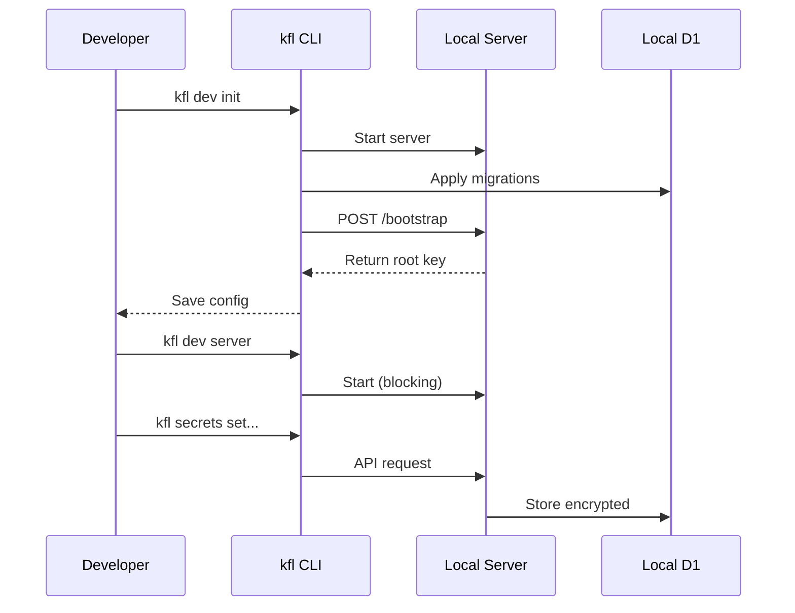

# Local Development

Run Keyflare entirely locally using Miniflare. **No Cloudflare account required.**

## Quick Start

```bash
# One-time setup: generates master key, applies migrations, bootstraps DB
kfl dev init

# Start the local server
kfl dev server
```

The local server runs at `http://localhost:8787`.

## What `kfl dev init` Does

<Steps>
  <Step title="Generate Master Key">
    Creates a random `MASTER_KEY` and writes it to `packages/server/.dev.vars`.
  </Step>

  <Step title="Apply Migrations">
    Applies all Drizzle migrations to the local Miniflare D1 SQLite database.
  </Step>

  <Step title="Start Server">
    Briefly starts `wrangler dev` in the background.
  </Step>

  <Step title="Bootstrap">
    Calls `POST /bootstrap` to create the first root user key.
  </Step>

  <Step title="Save Config">
    Saves `http://localhost:8787` and the root key to `~/.config/keyflare/`.
  </Step>
</Steps>

## Local Mode

Set `KEYFLARE_LOCAL=true` to make all `kfl` commands target the local server:

```bash
export KEYFLARE_LOCAL=true
export KEYFLARE_API_KEY=kfl_user_<key-from-dev-init>

# All commands now target localhost:8787
kfl projects create my-api
kfl env create development --project my-api
kfl secrets set DB_URL=postgres://localhost --project my-api --env development
```

Alternatively, configure `~/.config/keyflare/config.yaml`:

```yaml
api_url: "http://localhost:8787"
project: "my-api"
environment: "development"
```

## Expected Output

```
$ kfl dev init

🔥 Keyflare Local Setup

✓ Local master key ready (packages/server/.dev.vars)
✓ Local database schema up-to-date
✓ Local server ready at http://localhost:8787
✓ Root API key created

✓ Local setup complete!

Your root API key (saved to ~/.config/keyflare/):

  kfl_user_a1b2c3d4e5f6a7b8c9d0e1f2a3b4c5d6

Start the local server anytime with:

  kfl dev server

Or set these env vars to use the local instance:

  KEYFLARE_LOCAL=true
  KEYFLARE_API_KEY=kfl_user_a1b2c3d4e5f6a7b8c9d0e1f2a3b4c5d6
```

## Development Workflow



## Regenerate Master Key

If you need to reset the local database:

```bash
kfl dev init --force
```

<Warning>
  `--force` regenerates the local `MASTER_KEY`. All existing local data becomes unreadable.
</Warning>

## Building from Source

For contributing or modifying Keyflare:

```bash
# Clone the repo
git clone https://github.com/matthias-hausberger/keyflare.git
cd keyflare

# Install dependencies and build CLI
pnpm run setup

# Run local development
pnpm kfl dev init
pnpm kfl dev server
```

### Manual Local Setup

Alternative to `kfl dev init`:

```bash
# Copy example dev vars
cp .dev.vars.example packages/server/.dev.vars

# Apply migrations to local D1
cd packages/server
pnpm run db:migrate:local

# Start the server
pnpm run dev
# → http://localhost:8787

# Bootstrap
curl -s -X POST http://localhost:8787/bootstrap | python3 -m json.tool
# { "ok": true, "data": { "key": "kfl_user_..." } }
```

## Next Steps

<CardGroup cols={2}>
  <Card title="Contributing" href="/contributing/development">
    Learn how to contribute to Keyflare.
  </Card>

  <Card title="Deployment" href="/guides/deployment">
    Deploy to production on Cloudflare.
  </Card>
</CardGroup>
